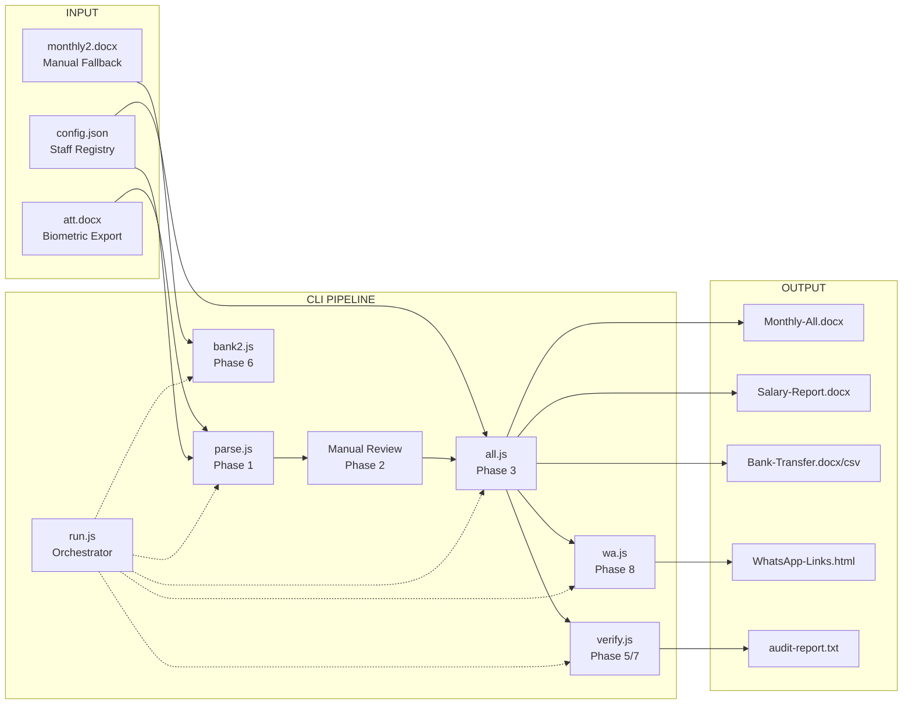
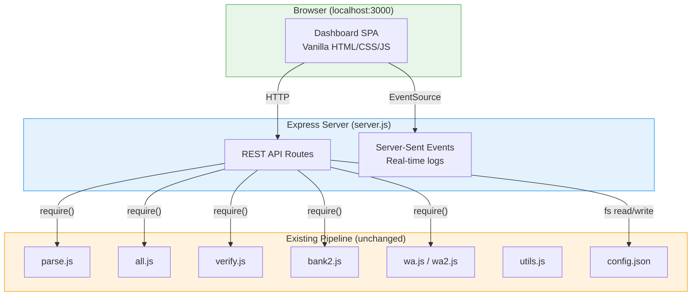

# GUI / Web UI Plan — DUHA Payroll System

This document explores how to add a graphical or web-based interface to the existing DUHA Payroll System, which currently operates as a CLI-driven Node.js pipeline.

---

## 1. Current System Architecture



### Key Characteristics

| Aspect | Current State |
|---|---|
| **Runtime** | Node.js (CommonJS, `require()`) |
| **Dependencies** | `adm-zip`, `docx`, `nodemailer`, `whatsapp-web.js` |
| **Data format** | JSON (`config.json`, `parsed.json`, `final_payroll.json`) |
| **Output format** | `.docx` (via `docx` lib), `.csv`, `.html`, `.txt` |
| **State** | File-system based (no database) |
| **User** | Single admin operator |
| **Module exports** | All scripts export `main()` or `verify()` — already callable programmatically |

> [!TIP]
> The fact that every script already exports its entry point (`main()`, `verify()`) means we can call them directly from a web server **without spawning child processes**. This is the single biggest advantage for a UI migration.

---

## 2. Three Approaches

### Approach A — Local Web UI (Express + Vanilla HTML/JS)

A lightweight local web server that wraps the existing scripts behind HTTP API endpoints, with a browser-based dashboard.

### Approach B — Electron Desktop App

A native-feeling desktop application that bundles the Node.js backend with a Chromium-based frontend.

### Approach C — Progressive Enhancement (Hybrid)

Keep the CLI as the primary interface but add a live HTML dashboard that reads output files and provides visual feedback — no backend server needed.

---

## 3. Approach Comparison

| Criteria | A: Local Web UI | B: Electron | C: Progressive |
|---|---|---|---|
| **Effort** | Medium (2-3 weeks) | High (4-6 weeks) | Low (3-5 days) |
| **New dependencies** | `express` only | `electron` (~100MB) | None |
| **Preserves CLI workflow** | ✅ Yes, API wraps CLI | ⚠️ Partially | ✅ Fully |
| **File upload (att.docx)** | ✅ Drag & drop | ✅ Native file dialog | ❌ Manual placement |
| **Real-time feedback** | ✅ WebSocket/SSE | ✅ IPC | ❌ Refresh-based |
| **Offline/portable** | ✅ Fully local | ✅ Fully local | ✅ Fully local |
| **Distributable** | Open browser | `.exe` installer | Open HTML file |
| **config.json editing** | ✅ Form-based UI | ✅ Form-based UI | ❌ Manual |
| **parsed.docx review** | ✅ In-browser table | ✅ In-app table | ❌ Open in Word |
| **Learning curve** | Low (Express is familiar) | Medium (Electron APIs) | Minimal |

---

## 4. Recommended Approach: **A — Local Web UI**

> [!IMPORTANT]
> **Approach A (Local Web UI with Express)** is the recommended path. It provides the best balance of effort, capability, and compatibility with the existing codebase. The CLI continues to work independently, and the web UI is an optional layer on top.

### Why Not Electron?

- Adds ~100MB+ to the project for the Chromium runtime
- Requires learning Electron's IPC/main-renderer architecture
- Overkill for a single-user, single-machine tool
- Harder to maintain and debug

### Why Not Progressive Only?

- Cannot trigger pipeline phases from the UI
- Cannot edit `config.json` or review `parsed.docx` visually
- Limited to read-only dashboards

---

## 5. Architecture — Local Web UI



### File Structure (New Files Only)

```
js-agv8/
├── server.js              ← Express server (NEW)
├── public/                ← Static frontend (NEW)
│   ├── index.html         ← Main dashboard
│   ├── style.css          ← Styles
│   └── app.js             ← Client-side logic
├── parse.js               (unchanged)
├── all.js                 (unchanged)
├── verify.js              (unchanged)
├── ...                    (all existing files unchanged)
```

---

## 6. API Design

### Phase Execution Endpoints

| Method | Endpoint | Action | Maps to |
|---|---|---|---|
| `POST` | `/api/parse` | Run Phase 1 | `parse.main()` |
| `POST` | `/api/generate` | Run Phase 3 | `all.main()` |
| `POST` | `/api/verify` | Run Phase 5 | `verify.verify()` |
| `POST` | `/api/verify?final=true` | Run Phase 7 | `verify.verify()` with `--final` |
| `POST` | `/api/bank2` | Run Phase 6 | `bank2.main()` |
| `POST` | `/api/whatsapp` | Run Phase 8 | `wa.main()` |
| `POST` | `/api/run-all` | Full pipeline | Orchestrated sequence |

### Data Endpoints

| Method | Endpoint | Action |
|---|---|---|
| `GET` | `/api/config` | Read `config.json` |
| `PUT` | `/api/config` | Write `config.json` |
| `GET` | `/api/config/staff` | Get staff list only |
| `PUT` | `/api/config/staff/:index` | Update a single staff entry |
| `GET` | `/api/parsed` | Read `temp/parsed.json` as JSON |
| `GET` | `/api/payroll` | Read `temp/final_payroll.json` |
| `GET` | `/api/audit` | Read `output/audit-report.txt` |
| `GET` | `/api/outputs` | List files in `output/` |
| `GET` | `/api/download/:filename` | Download any output file |

### File Upload

| Method | Endpoint | Action |
|---|---|---|
| `POST` | `/api/upload/att` | Upload `att.docx` → `input/att.docx` |
| `POST` | `/api/upload/monthly2` | Upload `monthly2.docx` → `input/monthly2.docx` |

### Real-Time Logs (Server-Sent Events)

| Method | Endpoint | Action |
|---|---|---|
| `GET` | `/api/logs` | SSE stream of console output during phase execution |

> [!NOTE]
> Console output capture works by temporarily overriding `console.log` and `console.error` during phase execution and piping the output to the SSE stream. The original functions are restored after each phase completes.

---

## 7. UI Pages & Layout

### Page 1: Dashboard (Home)

```
┌─────────────────────────────────────────────────────────┐
│  DUHA Payroll System          May 2026    [⚙ Settings]  │
├─────────────────────────────────────────────────────────┤
│                                                         │
│  ┌──────────┐  ┌──────────┐  ┌──────────┐              │
│  │ 53 Staff │  │ 23 W.Days│  │ ₿ 770K   │              │
│  │ Registry │  │ This Mon │  │ Total Net │              │
│  └──────────┘  └──────────┘  └──────────┘              │
│                                                         │
│  ── Pipeline ────────────────────────────────────────── │
│                                                         │
│  [1. Parse Attendance]  ● Ready                         │
│       ↓                                                 │
│  [2. Review Parsed]     ○ Waiting                       │
│       ↓                                                 │
│  [3. Generate Reports]  ○ Waiting                       │
│       ↓                                                 │
│  [5. Verify]            ○ Waiting                       │
│       ↓                                                 │
│  [8. WhatsApp]          ○ Waiting                       │
│                                                         │
│  ── Live Log ────────────────────────────────────────── │
│  │ > Reading edited temp/parsed.docx...                │
│  │ > Generating Final Reports...                       │
│  │ > ✓ Reports generated for May 2026                  │
│  └─────────────────────────────────────────────────────│
│                                                         │
│  ── Output Files ────────────────────────────────────── │
│  📄 Monthly-All-May-2026.docx            [⬇ Download]  │
│  📄 Monthly-All-May-2026-formatted.docx  [⬇ Download]  │
│  📄 Salary-Report-May-2026.docx          [⬇ Download]  │
│  📄 Bank-Transfer-May-2026.docx          [⬇ Download]  │
│  📄 Bank-Transfer-May-2026.csv           [⬇ Download]  │
│  📄 audit-report.txt                     [⬇ Download]  │
└─────────────────────────────────────────────────────────┘
```

### Page 2: Staff Config Editor

An interactive form for editing `config.json` staff entries — replaces manual JSON editing.

```
┌─────────────────────────────────────────────────────────┐
│  Staff Configuration                    [+ Add Staff]   │
├─────────────────────────────────────────────────────────┤
│  🔍 Search: [_______________]                           │
│                                                         │
│  ┌─ Hasina Mohammed ──────────────────── [Edit] [▼] ─┐ │
│  │  Basic: 32,000  |  Allowance: 13,000               │ │
│  │  Bank: 0951120057441  |  Role: Teacher              │ │
│  │  Exceptions: skipLateCheck ☐  OT: 0  Bonus: 0      │ │
│  └────────────────────────────────────────────────────┘ │
│                                                         │
│  ┌─ Nusrat Jahan Ira ────────────────── [Edit] [▼] ─┐ │
│  │  Basic: 25,000  |  Allowance: 0                    │ │
│  │  Bank: 0951120068375  |  Role: Teacher              │ │
│  └────────────────────────────────────────────────────┘ │
│  ...                                                    │
│                                                         │
│  ── Cycle Controls ──────────────────────────────────── │
│  Year: [2026]  Month: [5 ▼]  Locked: [☐]              │
│  Holidays: [4, 11, 14]   Tiffin Excl: [18, 25]        │
│                                [💾 Save Config]         │
└─────────────────────────────────────────────────────────┘
```

### Page 3: Attendance Review (Replaces Phase 2 manual Word editing)

An editable data table loaded from `temp/parsed.json`, replacing the need to open `parsed.docx` in Word.

```
┌─────────────────────────────────────────────────────────┐
│  Attendance Review — May 2026          [💾 Save Edits]  │
├────────┬───────┬──────┬──────┬──────┬──────┬───────────┤
│ Name   │ P.Day │ Leave│ Abs  │ Late │ >20m │ Details   │
├────────┼───────┼──────┼──────┼──────┼──────┼───────────┤
│ Hasina │  21 ✎ │  0 ✎ │  0 ✎ │  1 ✎ │  0   │ Lt:18(7m) │
│ Sadia  │  19 ✎ │  1 ✎ │  1 ✎ │  2 ✎ │  1   │ Ab:21 ... │
│ ...    │       │      │      │      │      │           │
└────────┴───────┴──────┴──────┴──────┴──────┴───────────┘
```

> [!TIP]
> Editable cells (marked with ✎) save changes back to `temp/parsed.json` via the API. This completely eliminates the need to open and edit `parsed.docx` in Microsoft Word.

### Page 4: Payroll Summary

A read-only table showing `final_payroll.json` with filtering, sorting, and highlighting of anomalies.

### Page 5: Verification Dashboard

Renders the `audit-report.txt` output in a structured, color-coded format with ✅/❌ indicators.

---

## 8. Technology Stack

| Layer | Technology | Rationale |
|---|---|---|
| **Server** | Express.js | Minimal, familiar, no build step, CommonJS compatible |
| **Frontend** | Vanilla HTML + CSS + JS | No framework needed for ~5 pages; keeps it lightweight |
| **Styling** | Custom CSS (dark mode) | Consistent with existing WhatsApp dashboard aesthetic |
| **Real-time** | Server-Sent Events (SSE) | Simpler than WebSockets for one-way log streaming |
| **File upload** | `multer` middleware | Standard Express file upload handler |
| **New deps** | `express`, `multer` | Only 2 new production dependencies |

---

## 9. Phase-by-Phase UI Mapping

| Pipeline Phase | CLI Command | UI Equivalent |
|---|---|---|
| **Phase 0** | Edit `config.json` manually | **Staff Config Editor** page with form inputs |
| **Phase 1** | `node parse.js` | **"Parse Attendance"** button + drag-drop upload for `att.docx` |
| **Phase 2** | Open `parsed.docx` in Word, edit | **Attendance Review** page with inline-editable table |
| **Phase 3** | `node all.js` | **"Generate Reports"** button + live log stream |
| **Phase 4** | Open `Monthly-All.docx`, annotate | *(Still in Word — generated file is the deliverable)* |
| **Phase 5** | `node verify.js` | **"Run Verification"** button → renders audit dashboard |
| **Phase 6** | `node bank2.js` | **"Generate Bank Letter (Legacy)"** button |
| **Phase 7** | `node verify.js --final` | **"Final Verify"** button |
| **Phase 8** | `node wa.js` | **"Generate WhatsApp"** button → opens existing HTML dashboard |
| **Phase 9** | Set `locked: true` | **Toggle switch** in the Config Editor |

---

## 10. Implementation Phases

### Phase I — Foundation (Days 1-3)
- [ ] Create `server.js` with Express, static serving, and basic routes
- [ ] Create `public/index.html` with dashboard skeleton
- [ ] Implement `GET /api/config` and `PUT /api/config`
- [ ] Implement `GET /api/outputs` and `GET /api/download/:filename`
- [ ] Basic CSS theming (dark mode, cards, status indicators)

### Phase II — Pipeline Integration (Days 4-7)
- [ ] Implement `POST /api/parse`, `/api/generate`, `/api/verify`
- [ ] Add console output capture and SSE streaming (`GET /api/logs`)
- [ ] Add file upload endpoints (`POST /api/upload/att`)
- [ ] Build pipeline stepper UI with status tracking
- [ ] Add live log panel with auto-scroll

### Phase III — Config Editor (Days 8-10)
- [ ] Build staff list with search/filter
- [ ] Build staff detail form (name, basic, allowance, bank, exceptions)
- [ ] Build cycle controls form (year, month, holidays, locked)
- [ ] Add validation feedback (highlight errors, prevent bad saves)
- [ ] Add "Add Staff" and "Remove Staff" functionality

### Phase IV — Attendance Review (Days 11-13)
- [ ] Load `temp/parsed.json` into an editable HTML table
- [ ] Support inline cell editing with `contenteditable` or input fields
- [ ] Save edits back via API → updates `parsed.json`
- [ ] Regenerate `parsed.docx` from the edited JSON (optional)
- [ ] Highlight changed cells vs. original auto-calculated values

### Phase V — Polish & Verification Dashboard (Days 14-16)
- [ ] Build verification results renderer (parse `audit-report.txt` or use JSON)
- [ ] Payroll summary view with sorting and search
- [ ] Responsive layout for smaller screens
- [ ] Error handling, loading states, confirmation dialogs
- [ ] Add `npm start` script to launch server

---

## 11. Server.js Skeleton (Conceptual)

> [!NOTE]
> This is a conceptual skeleton showing the structure — not executable code.

```javascript
// server.js — conceptual structure
const express = require('express');
const multer = require('multer');
const app = express();

app.use(express.json());
app.use(express.static('public'));

// ── Config endpoints ──
app.get('/api/config', (req, res) => { /* read config.json */ });
app.put('/api/config', (req, res) => { /* write config.json */ });

// ── Pipeline execution ──
app.post('/api/parse', async (req, res) => {
  const parse = require('./parse');
  await parse.main();             // <-- direct function call, no child_process
  res.json({ success: true });
});

app.post('/api/generate', async (req, res) => {
  const all = require('./all');
  await all.main();
  res.json({ success: true });
});

// ── File operations ──
app.get('/api/outputs', (req, res) => { /* list output/ files */ });
app.get('/api/download/:file', (req, res) => { /* send file */ });

// ── SSE for live logs ──
app.get('/api/logs', (req, res) => {
  res.setHeader('Content-Type', 'text/event-stream');
  // Override console.log, pipe to res.write()
});

app.listen(3000, () => console.log('Dashboard: http://localhost:3000'));
```

---

## 12. Effort & Risk Summary

| Item | Estimate | Risk |
|---|---|---|
| Express server + API routes | 2 days | Low — straightforward wrapping |
| Dashboard HTML/CSS/JS | 3 days | Low — static page with fetch calls |
| Config editor UI | 2 days | Medium — complex nested JSON form |
| Attendance review table | 2 days | Medium — editable table state management |
| SSE log streaming | 1 day | Low — well-documented pattern |
| File upload (multer) | 0.5 days | Low |
| Verification dashboard | 1 day | Low — read-only rendering |
| Testing & polish | 2 days | Low |
| **Total** | **~14 days** | |

### Risks

> [!WARNING]
> **Console capture side effects** — Overriding `console.log` during phase execution to capture output for SSE could cause issues if scripts use `process.stdout.write` directly or if errors crash mid-stream. Mitigation: wrap execution in try/catch and always restore original console functions.

> [!WARNING]
> **File locking on Windows** — As we've already seen, Windows locks `.docx` files when open in Word/Explorer preview. The UI should detect `EBUSY` errors and show a user-friendly "Please close the file" message rather than crashing.

> [!CAUTION]
> **No concurrent execution** — The pipeline is not designed for concurrent runs. The server must queue or reject overlapping phase executions to prevent race conditions on shared files (`config.json`, `temp/`, `output/`).

---

## 13. Future Enhancements (Post-MVP)

| Enhancement | Description |
|---|---|
| **Month history** | Archive `output/` per month, browse past payrolls from UI |
| **Diff viewer** | Show what changed between auto-calculated and manual-edited attendance |
| **Bulk exception editor** | Apply the same bonus/increment to multiple staff at once |
| **PDF export** | Generate PDF versions of reports alongside DOCX |
| **Mobile-responsive** | Make the dashboard usable on a phone/tablet |
| **Auto-backup** | Snapshot `config.json` before each edit for easy rollback |
| **Notification preview** | Render WhatsApp messages in-browser before sending |
| **Multi-user auth** | Add login if multiple admins need access (unlikely for this use case) |

---

## 14. Quick-Start Path (If You Want to Begin Today)

The fastest way to get a visual interface with **zero new code**:

1. **Already exists:** `output/WhatsApp-Links-May.html` — an interactive browser dashboard
2. **Already exists:** `temp/final_payroll.json` — machine-readable payroll data
3. **Quickest win:** Create a single `dashboard.html` in `output/` that reads `final_payroll.json` and renders a searchable, sortable payroll summary table — no server needed, just open in Chrome.

This "Approach C" quick-win can be built in **under 2 hours** and gives immediate visual value while you plan the full web UI.
