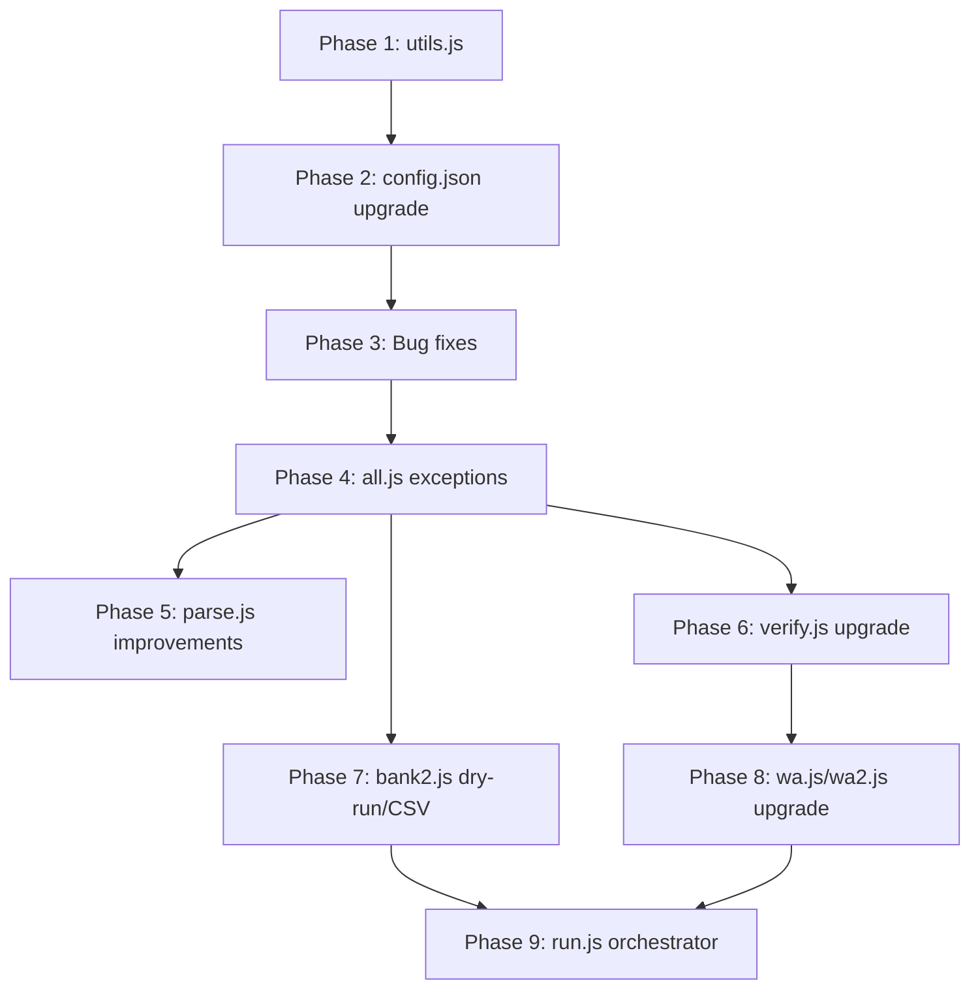

**Act like a Senior Data Automation Engineer and Payroll Systems Architect.**

**Objective:** Fully automate the transformation of multiple semi-structured input documents (attendance, policies, and salary data) into structured payroll outputs for a school staff system. Ensure maximum accuracy, strict adherence to policy rules, and exact matching of the provided output file structures.

### **Data Inputs (Attached Context):**
You will be provided with the following source files:
1. **`att.pdf`**: Monthly attendance data for school staff (days present, absent, leave, etc.).
2. **`policies`**: Document outlining all salary rules, attendance-based adjustments, deductions, bonuses, and late penalties.
3. **`salaries.txt`**: Individual salary baselines, including basic pay and total salary per employee.
4. **`Sample Output Files`**: Pre-existing templates/samples for `monthly-all`, `salary-report`, and `bank-sample` showing the exact structure, format, and previous data layout you must replicate.

### **Step-by-Step Execution:**

**Step 1: Data Extraction & Parsing**
* Carefully read and extract structured data from `att.docx`, `policies`, and `salaries.txt`.
* Map each staff member's compensation baseline, noting their basic and total salary.
* Normalize the extracted data into a consistent internal structure (e.g., employee ID, name, attendance days, salary components) to prepare for calculations. 
* *Note: As you are working with semi-structured documents, infer structure carefully without inventing data. Flag any inconsistencies or missing data gracefully.*

**Step 2: Policy Application & Calculation**
* Strictly apply the rules defined in the `policies` document to the merged data.
* Compute attendance-based deductions, rule-based adjustments, bonuses, and any other compensation rules.
* Calculate the final payable net salary for every employee. Ensure calculations are accurate, traceable, and internally validated before generating outputs.

**Step 3: Generate Outputs**
Based on your calculations, generate the following three files. **CRITICAL REQUIREMENT:** You must output these exactly in the same structure and format as the provided sample files.

1. **`monthly-all` file:** * A comprehensive monthly payroll summary covering all employees.
   * Must include: Employee Name/ID, attendance data, basic salary, all calculated additions/deductions, net salary due, and calculation notes.
2. **`salary-report` files:** * Detailed individual salary reports (payslips) for each staff member.
   * Must include: Clear itemization of the personal salary breakdown, specific deductions applied, net amount due, and a clear trace of how the final salary was calculated.
3. **`bank-sample` file:** * A delimited file formatted for bulk bank transfer/payroll processing.
   * Must include: Staff member names/IDs, bank account details (as available/inferred from input data), and the final net salary amounts due.

### **Constraints & Guidelines:**
* **Strict Formatting:** The output files must mirror the exact structure, headers, and format of the provided sample files.
* **Scope:** Use only the provided data; do not assume or invent external values. 
* **Style:** Precise, structured, and no fluff. Use clean tables and clearly labeled sections where appropriate.
* **Reasoning:** Think step-by-step internally before producing outputs. Validate all calculations and ensure total consistency across all three generated files.

Take a deep breath and work on this problem step-by-step. Begin by acknowledging the inputs, performing your internal calculations, and then outputting the finalized file contents.

### Automated Payroll & Attendance Processing Plan

**Phase 0: Configuration Update**
*   Update `config.json` to handle any specific exceptions, salary increments, or parameter adjustments required for the current billing cycle.

**Phase 1: Attendance Data Parsing**
*   Execute `parse.js` to extract and process the raw attendance data from `att.docx`. 

**Phase 2: Manual Review & Verification**
*   Review the generated `parsed.docx`.
*   Cross-check the digital data against the printed attendance reports and manually correct any discrepancies.

**Phase 3: Master Spreadsheet Generation**
*   Run `all.js` to compile the verified data from `parsed.docx` into the comprehensive monthly spreadsheet.

**Phase 4: Spreadsheet Data Entry & Formula Verification**
*   Review and update the master spreadsheet. 
*   Ensure all embedded formulas are active to automate calculations.
*   Verify that mandatory data columns are populated, including:
    *   Late dates and total late minutes.
    *   Absent dates.
    *   Detailed calculation explanations/breakdowns.

**Phase 5: Mathematical Validation**
*   Execute the `math.sh` script to scan the spreadsheet for logic or calculation errors.
*   Investigate and fix any mathematical mistakes flagged by the script.

**Phase 6: Bank Statement Generation & Audit**
*   Run `bank.js` using the finalized spreadsheet to generate the official bank statement.
*   Export a copy of the statement to CSV format for streamlined processing.
*   Execute `audit.js` to cross-check the generated outputs. Resolve any mismatches detected during the audit before proceeding.

**Phase 7: Notification Dispatch**
*   Generate and send automated notifications directly from the validated spreadsheet using the designated scripts:
    *   Run `wa.js` or `wa2.js` for WhatsApp notifications.
    *   Run `email.js` for email distributions.

### **Monthly Staff Attendance & Payroll Execution Plan**

**Phase 0: System Configuration & Initialization**
*   Update the `config.json` file with the current month’s parameters. This includes capturing any specific staff exceptions, salary increments, or unique cycle conditions before processing begins.

**Phase 1: Raw Data Extraction**
*   Execute `parse.js` to extract raw biometric and attendance data from the initial `att.docx` file.

**Phase 2: Manual Verification & Alignment**
*   Conduct a line-by-line cross-check between the newly generated `parsed.docx` and the physical, printed attendance report. 
*   Manually update and reconcile any discrepancies in the parsed document to ensure absolute accuracy regarding staff leave and presence.

**Phase 3: Master Spreadsheet Generation**
*   Run `all.js` utilizing the finalized `parsed.docx` to generate the consolidated monthly master spreadsheet.

**Phase 4: Data Entry & Formula Optimization**
*   Update the master spreadsheet with the current cycle's data. 
*   Implement and verify automated formulas to track late dates/minutes, absent dates, and clear calculation explanations. Ensure all deduction logic strictly utilizes the most recent per-day salary figures to guarantee accurate final payouts.

**Phase 5: Calculation Quality Assurance**
*   Execute `math.sh` against the spreadsheet to automatically scan for any formula errors or mathematical mistakes.
*   Manually review and resolve any flagged discrepancies before locking the financial data.

**Phase 6: Financial Disbursement & Auditing**
*   *Optional:* Export a copy of the master spreadsheet to CSV format for streamlined data handling.
*   Execute `bank.js` to generate the official bank statement file directly from the approved spreadsheet.
*   Run `audit.js` to cross-reference the generated bank statement against the master data. If the audit flags a mismatch, trace and resolve the error immediately.

**Phase 7: Automated Staff Notifications**
*   Execute `wa.js`/`wa2.js` (for WhatsApp) or `email.js` to generate and distribute individualized payroll and attendance summaries to the staff directly from the verified master spreadsheet.


# DUHA PAYROLL SYSTEM — MASTER UPDATE PROMPT

**Role:** You are a Senior Node.js Engineer and Payroll Systems Architect.
**Task:** Upgrade the existing payroll automation project to match the improved pipeline plan below.
**Constraint:** You must study the existing code before modifying it. Do not break working logic — extend it.

---

## EXISTING ARCHITECTURE (READ FIRST)

The project currently has these scripts and file contracts:

```
project/
├── config.json             ← Source of truth for all staff, policies, holidays
├── input/
│   ├── att.docx            ← Raw biometric attendance export
│   └── monthly2.docx       ← Manually maintained salary sheet (legacy fallback)
├── temp/
│   ├── parsed.json         ← Output of parse.js (raw structured data)
│   └── parsed.docx         ← Human-editable review table (output of parse.js)
├── output/
│   ├── Monthly-All-{Month}-{Year}.docx    ← Master payroll table (all.js)
│   ├── Salary-Report-{Month}-{Year}.docx  ← Per-employee salary slips (all.js)
│   ├── Bank-Transfer-{Month}-{Year}.docx  ← Bank letter from all.js
│   ├── bank2.docx                         ← Bank letter from bank2.js (monthly2 source)
│   ├── wa-data-{Month}.js                 ← WA message data from wa.js
│   ├── WhatsApp-Links-{Month}.html        ← WA dashboard from wa.js
│   ├── wa-data-monthly2.js                ← WA message data from wa2.js
│   ├── WhatsApp-Links-monthly2.html       ← WA dashboard from wa2.js
│   └── audit-report.txt                   ← Output of verify.js
├── parse.js     ← Phase 1: att.docx → temp/parsed.json + temp/parsed.docx
├── all.js       ← Phase 3: parsed.json + parsed.docx → Monthly-All, Salary-Report, Bank-Transfer
├── verify.js    ← Phase 5/7: Cross-checks Monthly-All, Bank-Transfer, monthly2.docx
├── bank2.js     ← Phase 6 alt: monthly2.docx → bank2.docx (manual input path)
├── wa.js        ← Phase 8: Monthly-All → WhatsApp dashboard
└── wa2.js       ← Phase 8 alt: monthly2.docx + Monthly-All logs → WA dashboard
```

### How all.js works (critical to understand):
- Reads `temp/parsed.json` (auto-computed by parse.js)
- Reads `temp/parsed.docx` (manually edited by staff after Phase 2 review)
- Merges both: manual edits override auto values only where they differ
- Computes: `perDay = Math.round(basic / 25)`, `tiffin = eligibleDays × 25`
- `tiffinExclusionDays` + Saturdays are excluded from tiffin count
- Late penalty rules: over20Fine (300/instance) + latePenalties tier (100/150/200 per late) + perDay deducted if late >= 3
- Outputs Monthly-All with a `Details` column (col 18) containing `"Ab:3,10 Lt:5(2m),12(8m)"` format
- Outputs `temp/final_payroll.json` for downstream scripts

### How verify.js works:
- Reads Monthly-All col layout: `[0]=Name, [1]=W.Days, [2]=P.Days, [12]=Basic, [13]=Allowance, [14]=Tiffin, [16]=TotalDed, [17]=Net`
- Math check: `calc = basic + allowance + tiffin - deduction`; compares to `net`
- Cross-checks same net against Bank-Transfer and monthly2.docx
- Outputs `output/audit-report.txt`
- **BUG: hardcodes "53 staff members" — must use `config.staff.length`**

### How bank2.js works:
- Alternative to all.js bank output — reads from `input/monthly2.docx` directly
- Used when the automated pipeline has not been run and monthly2.docx is the source of truth
- Produces same format as all.js's bank letter

### How wa.js and wa2.js work:
- `wa.js` reads the latest `output/Monthly-All-*.docx` → WA messages
- `wa2.js` reads `input/monthly2.docx` + merges `Details` column logs from Monthly-All
- Both output a `.js` data file + `.html` click-to-send dashboard
- Messages use a `formatLogs()` that parses the `Ab:/Lt:/Lv:` format from the Details column
- Both skip overwriting if the data file already exists (to protect manual edits)

---

## KNOWN BUGS TO FIX

Fix these in the relevant scripts as part of the update:

1. **verify.js line ~56**: `"All 53 staff members"` is hardcoded.
   - Fix: Replace with `` `All ${config.staff.length} staff members` ``

2. **config.json — name mismatch**: Entry is `"Ayesha Siddika"` but monthly2.docx has `"AYESHA SIDDIKA RUBA"`.
   - Fix: Update config to `"Ayesha Siddika Ruba"` and update `bank.acct` accordingly.

3. **all.js — OT/Increment/Bonus/PF columns always output "0"**: These columns exist in the Monthly-All table but are never populated from config.
   - Fix: Add per-staff `exceptions` support in config.json (see Phase 0 upgrade below).

4. **all.js — missing `role` on computed payroll**: The cash disbursement group in the bank letter shows a `role` field, but `computePayroll()` doesn't attach `s.role` to the result.
   - Fix: Add `role: s.role || "Teacher"` to both the computed result and the zero-data fallback in all.js.

5. **wa.js — month name detection**: It extracts month from the filename regex `Monthly-All-(.*)-\d{4}\.docx`. This works but is fragile.
   - Fix: Read month from `config.json` directly using `new Date(config.year, config.month-1).toLocaleString('en-US', { month: 'long' })`.

6. **wa2.js — month detection**: Uses a hacky string match against staff notes. 
   - Fix: Same as above — read from config.json.

---

## PHASE-BY-PHASE UPGRADE PLAN

---

### PHASE 0 — config.json Schema Upgrade

**Current:** config has `staff[].basic`, `staff[].allowance`, `staff[].bank`, `staff[].email`, `staff[].role` (missing), `staff[].threshold` (missing from some).

**Add the following fields** to config.json schema:

```json
{
  "schoolName": "DUHA INTERNATIONAL SCHOOL",
  "year": 2026,
  "month": 4,
  "locked": false,
  "policies": {
    "standardThreshold": "07:49 AM",
    "tiffinRate": 25,
    "over20Fine": 300,
    "latePenalties": [
      { "min": 11, "fine": 200 },
      { "min": 6,  "fine": 150 },
      { "min": 1,  "fine": 100 }
    ]
  },
  "holidays": [4, 11, 14],
  "tiffinExclusionDays": [18, 25],
  "daySpecificThresholds": { "30": "07:50 AM" },
  "staff": [
    {
      "name": "Example Staff",
      "role": "Teacher",
      "basic": 15000,
      "allowance": 3000,
      "threshold": null,
      "bank": { "acct": "09511XXXXXXX", "mob": "017XXXXXXXX" },
      "email": "",
      "exceptions": {
        "ot": 200,
        "increment": 0,
        "bonus": 0,
        "pfDeduction": 0,
        "pfReturn": 0,
        "note": "",
        "skipLateCheck": false,
        "skipAbsentDeduction": false,
        "overridePdays": null,
        "overrideAbsent": null
      }
    }
  ],
  "notifications": {
    "email": { "host": "", "port": 465, "user": "", "pass": "" },
    "whatsapp": { "enabled": true }
  }
}
```

**Rules for `exceptions`:**
- `ot`: overtime pay to add (BDT). Sourced from attendance date + overtime policy.
- `increment`: one-time increment to add to net this month only.
- `bonus`: one-time bonus to add to net.
- `pfDeduction`: provident fund deduction amount.
- `pfReturn`: PF return (added back, shown separately).
- `note`: shown in markings column and WA message.
- `skipLateCheck`: if `true`, late count = 0, no late deductions applied.
- `skipAbsentDeduction`: if `true`, absent deduction = 0 even if A.Days > 0.
- `overridePdays` / `overrideAbsent`: direct overrides that bypass attendance parsing entirely.

**Add a validation script block** in config.json loading (used by all scripts):
```js
// Add this helper to a shared utils.js that all scripts import
function validateConfig(config) {
  if (config.locked) {
    console.warn("⚠️  WARNING: config.json is locked. Outputs are for reference only.");
  }
  config.staff.forEach(s => {
    if (!s.name) throw new Error("Staff entry missing name");
    if (typeof s.basic !== 'number') throw new Error(`${s.name}: basic must be a number`);
  });
}
```

---

### PHASE 1 — parse.js Improvements

**Current behavior:** Reads `input/att.docx`, outputs `temp/parsed.json` + `temp/parsed.docx`.

**Improvements to implement:**

1. **Unmatched staff warning**: After parsing, cross-check parsed names against `config.staff`. Log any name in the docx not found in config (typo risk) and any config staff not found in the docx (absent from register).
   ```
   ⚠️  In att.docx but NOT in config: "Farida Tamanna" (check spelling)
   ⚠️  In config but NOT in att.docx: "Nusrat Jahan Era" (no attendance data)
   ```

2. **Parse summary file**: Write `temp/parse-summary.txt`:
   ```
   Parse Summary — April 2026
   Total parsed: 48
   Working days (auto): 23
   Holidays: 4, 11, 14 (Fridays auto-added)
   Saturdays: 6, 13, 20, 27
   Unmatched in config: 1
   Missing from att: 3
   ```

3. **Respect `exceptions.overridePdays` and `exceptions.overrideAbsent`**: If a staff member has these set in config, skip auto-calculation for those fields and use the override values directly.

4. **Respect `exceptions.skipLateCheck`**: If true, do not calculate lateness for that staff member.

---

### PHASE 2 — Manual Review (no code change, process improvement)

The `temp/parsed.docx` now has 8 columns: `[Name, Role, P, L, Ab, Absent Dates, Late, Late Details]`.

**Checklist to follow before running all.js:**
- [ ] Compare every row's P+L+Ab against the printed report
- [ ] Verify absent dates list matches highlighted cells in print
- [ ] Check that Saturday entries are not counted as late
- [ ] Confirm any staff with `exceptions` set in config are noted
- [ ] Save parsed.docx after edits

---

### PHASE 3 — all.js Improvements

**Current behavior:** Reads parsed.json + parsed.docx, computes payroll, generates 3 docx files + final_payroll.json.

**Improvements to implement:**

1. **Apply `exceptions` from config.json** in `computePayroll()`:
   ```js
   const exc = staffCfg.exceptions || {};

   // Overrides
   if (exc.overridePdays !== null && exc.overridePdays !== undefined) finalPdays = exc.overridePdays;
   if (exc.overrideAbsent !== null && exc.overrideAbsent !== undefined) finalAbsent = exc.overrideAbsent;
   if (exc.skipLateCheck) { finalLate = 0; lateDed = 0; }
   if (exc.skipAbsentDeduction) absDed = 0;

   // Additions
   const ot = exc.ot || 0;
   const increment = exc.increment || 0;
   const bonus = exc.bonus || 0;
   const pfDeduction = exc.pfDeduction || 0;
   const pfReturn = exc.pfReturn || 0;

   const net = Math.max(0, gross - totalDed) + tiffin + ot + increment + bonus - pfDeduction + pfReturn;
   ```

2. **Populate OT, Increment, Bonus, PF columns** in the Monthly-All table output (currently all "0"):
   ```js
   // In buildMonthlyAll() dataRows, replace hardcoded "0"s with:
   [p.name, empWorkingDays, p.pdays, p.leave, p.absent, p.late,
    p.ot, p.increment, p.bonus, p.pfDeduction, p.pfReturn,
    p.perDay, p.basic, p.genAllow, p.tiffin, p.gross, p.totalDed, p.net,
    p.markings, p.exceptions?.note || ""]
   ```

3. **Add `Lv:` (leave dates) to the Details/markings column**, alongside existing `Ab:` and `Lt:`:
   ```js
   const markings = [
     absentDates.length ? `Ab:${absentDates.join(',')}` : '',
     lateInfo.length ? `Lt:${lateInfo.join(',')}` : '',
     leaveDates.length ? `Lv:${leaveDates.join(',')}` : ''
   ].filter(Boolean).join(' ');
   ```

4. **Add `role` to payroll object** in both computed and fallback paths:
   ```js
   // In computePayroll return:
   return { ...emp, role: staffCfg.role || "Teacher", ... };
   
   // In zero-data fallback:
   return { name: s.name, role: s.role || "Teacher", ... };
   ```

5. **Locked config guard**: At the start of main(), check:
   ```js
   if (config.locked) {
     console.error("❌ config.json is locked. Unlock it before generating new reports.");
     process.exit(1);
   }
   ```

6. **Calculation note upgrade**: Include OT, Increment, Bonus, PF in the note:
   ```
   Hasina Mohammed -> Basic:32000 + Allow:13000 + Tiffin:525 + OT:200 - AbsDed:0 - LateDed:0 - PF:0 + Bonus:0 + Incr:0 = Net:45725
   ```

---

### PHASE 4 — Spreadsheet Update (process only, no code change)

After `all.js` generates outputs, manually update the Monthly-All docx:
- Fill in the `Markings` column (col 19) for special notes (e.g. "Yellow Mark", "Resigned", "Lates accepted")
- Confirm the `Details` column (col 18) has correct Ab/Lt/Lv dates
- Do not edit Net Payable directly — fix the source data (config.json or parsed.docx) and re-run all.js

---

### PHASE 5 — verify.js Improvements

**Current behavior:** Parses 3 docx files, checks math and cross-file consistency, outputs audit-report.txt.

**Improvements to implement:**

1. **Fix hardcoded staff count**:
   ```js
   // Replace:
   log(`  ✅ All 53 staff members are present in the Monthly Report.`);
   // With:
   log(`  ✅ All ${config.staff.length} staff members are present in the Monthly Report.`);
   ```

2. **Add OT/Increment/Bonus/PF to math check**: Current formula `basic + allowance + tiffin - deduction` misses exceptions. Update to:
   ```js
   // Read from Monthly-All columns (update parseDocx config):
   // col 6=OT, 7=Increment, 8=Bonus, 9=PFDeduction, 10=PFReturn
   const calc = m.basic + m.allowance + m.tiffin + m.ot + m.increment + m.bonus - m.pfDeduction + m.pfReturn - m.deduction;
   ```

   Update `parseDocx()` for monthlyData to extract these additional columns:
   ```js
   const monthlyData = parseDocx(monthlyFile, {
     nameCol: 0, detectCol: 1,
     basicCol: 12, allowanceCol: 13, tiffinCol: 14,
     otCol: 6, incrementCol: 7, bonusCol: 8,
     pfDedCol: 9, pfReturnCol: 10,
     deductionCol: 16, netCol: 17
   });
   ```
   And update `parseDocx()` to extract these new fields.

3. **Add anomaly detection** — flag employees whose net changed by more than 20% vs previous month:
   ```js
   // Load previous month's audit if it exists
   const prevAuditFile = `output/audit-${prevMonthName}-${config.year}.json`;
   // Compare and flag large changes
   ```
   Save a JSON snapshot of this month's verified nets as `output/audit-{Month}-{Year}.json` for future comparison.

4. **Grand total check**: Add explicit total validation:
   ```js
   const bankTotal = [...bankData values].reduce((s, e) => s + e.net, 0);
   const cashTotal = [...cashData values].reduce((s, e) => s + e.net, 0);
   log(`\n[4] GRAND TOTAL RECONCILIATION:`);
   log(`  Bank Total: BDT ${bankTotal.toLocaleString()}`);
   log(`  Cash Total: BDT ${cashTotal.toLocaleString()}`);
   log(`  Combined:   BDT ${(bankTotal + cashTotal).toLocaleString()}`);
   log(`  Monthly-All Grand: BDT ${totalShown.toLocaleString()}`);
   const reconciled = (bankTotal + cashTotal) === totalShown;
   log(`  ${reconciled ? '✅ Grand total reconciled.' : '❌ GRAND TOTAL MISMATCH!'}`);
   ```

5. **Duplicate detection**: Warn if any employee appears in both Bank and Cash groups.

6. **Save JSON snapshot**:
   ```js
   fs.writeFileSync(`output/audit-snapshot-${monthName}-${config.year}.json`,
     JSON.stringify({ month: monthName, year: config.year, staff: auditSnapshot }, null, 2));
   ```

---

### PHASE 6 — bank.js / bank2.js

**No major code changes needed.** The bank letter format is correct. Apply these minor improvements:

1. **bank2.js**: Add the same `role` fix — currently `emp.role` may be undefined for cash staff parsed from monthly2.docx if not in config. Guard with `|| "Teacher"`.

2. **Both bank scripts**: Add a `--dry-run` flag:
   ```js
   const isDryRun = process.argv.includes('--dry-run');
   if (isDryRun) {
     console.log("DRY RUN — Bank/Cash split:");
     bankStaff.forEach(e => console.log(`  [BANK] ${e.name.padEnd(30)} BDT ${e.net}`));
     cashStaff.forEach(e => console.log(`  [CASH] ${e.name.padEnd(30)} BDT ${e.net}`));
     console.log(`  Bank Total: BDT ${bankTotal.toLocaleString()}`);
     console.log(`  Cash Total: BDT ${cashTotal.toLocaleString()}`);
     return;
   }
   ```

3. **CSV export**: After generating the docx, auto-export a CSV copy:
   ```js
   const csvLines = ["SL,Name,Branch,Account,Mobile,Salary"];
   bankStaff.forEach((e, i) => csvLines.push(`${i+1},"${e.name}","Halishahar","${e.acct}","${e.mob}",${e.net}`));
   fs.writeFileSync(`output/Bank-Transfer-${monthName}-${config.year}.csv`, csvLines.join('\n'));
   console.log(`✓ CSV exported.`);
   ```

---

### PHASE 7 — Final verify.js Run

Run `node verify.js` a second time after bank outputs are generated. No code changes needed — the same script serves both verification passes.

**Add a CLI flag to distinguish passes:**
```js
// At the top of verify.js:
const isFinal = process.argv.includes('--final');
log(`           MODE: ${isFinal ? 'FINAL (post-bank)' : 'INTERMEDIATE (pre-bank)'}`);
```

**When `--final` is passed**, perform the additional bank reconciliation check (from Phase 5 improvement #4 above).

---

### PHASE 8 — wa.js / wa2.js Improvements

**Improvements to implement in both files:**

1. **Fix month detection** — read directly from config, not from filename or notes:
   ```js
   const config = JSON.parse(fs.readFileSync('config.json', 'utf8'));
   const monthName = new Date(config.year, config.month - 1).toLocaleString('en-US', { month: 'long' });
   ```

2. **Include exception notes in WA message**: If a staff member has `exceptions.note` set in config, append it to the message:
   ```js
   const staffCfg = config.staff.find(s => normalize(s.name) === normalize(t.name));
   const excNote = staffCfg?.exceptions?.note || "";
   const noteStr = excNote ? `\n📌 *NOTE:* ${excNote}` : '';
   ```
   Insert `noteStr` in the message after the deductions block.

3. **Add OT, Increment, Bonus, PF lines to the financial summary** in the WA message:
   ```
   *FINANCIAL SUMMARY*
   - Base Salary  : BDT 15,000
   - Allowances   : BDT 3,000
   - Tiffin Alloc : BDT 525
   - Overtime     : BDT 200        ← show only if > 0
   - Increment    : BDT 2,000      ← show only if > 0
   - Bonus        : BDT 3,000      ← show only if > 0
   - PF Deduction : - BDT 5,000    ← show only if > 0
   - Deductions   : - BDT 960
   ```
   Pull these from the Monthly-All docx columns 6–10 (OT, Increment, Bonus, PF Ded, PF Return).

4. **Add a `--preview` flag** that prints the first 3 messages to console without writing files:
   ```
   node wa.js --preview
   ```

5. **Add staff count summary** at the end:
   ```
   ✓ Generated 49 messages (34 with phone, 15 without phone number)
   ⚠️  Staff without phone numbers: Najmul Haque Masum, Sania Rahman, ...
   ```

---

## SHARED UTILITIES — Create utils.js

Extract common functions used across multiple scripts into a single `utils.js`:

```js
// utils.js
function normalize(name) { return name.toLowerCase().replace(/[^a-z]/g, '').trim(); }

function timeToMins(timeStr) { /* ... existing logic ... */ }

function numberToWords(n) { /* ... existing logic from bank2.js ... */ }

function findStaffConfig(empName, staff) {
  const norm = normalize(empName);
  return staff.find(s => normalize(s.name) === norm)
      || staff.find(s => { const sn = normalize(s.name); return norm.includes(sn) || sn.includes(norm); })
      || null;
}

function validateConfig(config) {
  if (config.locked) console.warn("⚠️  config.json is locked.");
  config.staff.forEach(s => {
    if (!s.name) throw new Error("Staff entry missing name");
    if (typeof s.basic !== 'number') throw new Error(`${s.name}: basic must be a number`);
  });
}

module.exports = { normalize, timeToMins, numberToWords, findStaffConfig, validateConfig };
```

Then in each script replace the local definitions:
```js
const { normalize, timeToMins, findStaffConfig } = require('./utils');
```

---

## FOLDER STRUCTURE AFTER UPDATE

```
project/
├── config.json           ← Updated schema with exceptions, locked flag, role fields
├── utils.js              ← NEW: shared helpers
├── input/
│   ├── att.docx
│   └── monthly2.docx
├── temp/
│   ├── parsed.json
│   ├── parsed.docx
│   ├── final_payroll.json
│   └── parse-summary.txt   ← NEW
├── output/
│   ├── Monthly-All-{Month}-{Year}.docx
│   ├── Salary-Report-{Month}-{Year}.docx
│   ├── Bank-Transfer-{Month}-{Year}.docx
│   ├── Bank-Transfer-{Month}-{Year}.csv   ← NEW
│   ├── bank2.docx
│   ├── wa-data-{Month}.js
│   ├── WhatsApp-Links-{Month}.html
│   ├── wa-data-monthly2.js
│   ├── WhatsApp-Links-monthly2.html
│   ├── audit-report.txt
│   └── audit-snapshot-{Month}-{Year}.json  ← NEW
├── parse.js
├── all.js
├── verify.js
├── bank2.js
├── wa.js
└── wa2.js
```

---

## EXECUTION ORDER (updated pipeline)

```bash
# Phase 0 — update config.json manually
#   Set month, year, exceptions, locked: false

# Phase 1
node parse.js
#   → Outputs: temp/parsed.json, temp/parsed.docx, temp/parse-summary.txt

# Phase 2 — manual review of temp/parsed.docx vs printed report
#   Edit parsed.docx as needed. Save.

# Phase 3
node all.js
#   → Outputs: Monthly-All, Salary-Report, Bank-Transfer docx + temp/final_payroll.json

# Phase 4 — update Markings column in Monthly-All.docx manually if needed

# Phase 5 — first verify pass
node verify.js
#   → Outputs: audit-report.txt, audit-snapshot.json
#   Fix any ❌ errors, re-run all.js, repeat

# Phase 6
node bank2.js               # if using monthly2.docx as source
# or use Bank-Transfer output from all.js directly
node bank2.js --dry-run     # preview split without writing

# Phase 7 — final verify
node verify.js --final
#   Fix any remaining issues before dispatch

# Phase 8
node wa.js --preview        # preview first 3 messages
node wa.js                  # generate WhatsApp dashboard
node wa2.js                 # generate monthly2-based WA dashboard (if needed)
```

---

## PRIORITY ORDER FOR IMPLEMENTATION

Implement in this order to maintain a working system at each step:

1. **utils.js** — extract shared code first, update all imports
2. **config.json** — add `exceptions`, `role`, `locked` fields for all staff
3. **Bug fixes** — verify.js staff count, wa.js/wa2.js month detection, all.js role field
4. **all.js exceptions** — apply OT/Increment/Bonus/PF/overrides from config
5. **all.js markings** — add Lv: dates, populate OT/Incr/Bonus/PF table columns
6. **verify.js** — update math check columns, add grand total reconciliation, anomaly detection
7. **bank2.js/all.js bank** — add CSV export and dry-run flag
8. **wa.js/wa2.js** — add exception notes, OT/bonus lines in message, preview flag, phone summary
9. **parse.js** — add unmatched staff warnings, parse-summary.txt, respect exception overrides

# DUHA Payroll System — Master Upgrade Implementation Plan

## Background

Upgrade the existing 8-script payroll pipeline (parse → all → verify → bank2 → wa/wa2) to support per-staff exceptions (OT, increment, bonus, PF), shared utilities, enhanced verification, and an all-in-one orchestrator script. The codebase is at `/mnt/3E82263038478F81/DUHA/dis-docs/hr/js-ag-v7/`.

> [!IMPORTANT]
> All changes are additive — no working logic will be broken. Each phase produces a working system before moving to the next.

---

## Open Questions

1. **Ayesha Siddika → Ayesha Siddika Ruba**: Should the bank account number also be updated, or just the name? (Currently `acct: ""` so likely just the name.)
2. **audit.js & reconcile.js**: These exist alongside verify.js — should they be kept as-is, deprecated, or merged into the upgraded verify.js?
3. **mail.js & notify.js**: These are not mentioned in the upgrade plan — leave untouched?
4. **All-in-one script**: Should it support running individual phases (e.g., `node run.js --phase 3`) or only the full pipeline?

---

## Proposed Changes

### Phase 1: Create `utils.js` — Shared Utilities

#### [NEW] [utils.js](file:///mnt/3E82263038478F81/DUHA/dis-docs/hr/js-ag-v7/utils.js)

Extract duplicated functions from all scripts into one module:

| Function | Currently duplicated in |
|---|---|
| `normalize(name)` | all.js, parse.js, verify.js, bank2.js, wa.js, wa2.js, audit.js, reconcile.js |
| `timeToMins(timeStr)` | all.js, parse.js |
| `numberToWords(n)` | all.js (line 327), bank2.js (line 79) |
| `findStaffConfig(name, staff)` | all.js (line 91), parse.js (line 42), bank2.js (line 26) |
| `validateConfig(config)` | NEW — validates staff entries, warns on lock |
| `getVal(str)` | verify.js (line 9), reconcile.js (line 10) |
| `formatLogs(str, monthName)` | wa.js (line 39), wa2.js (line 70) |

After creating utils.js, update **all 6 main scripts** to `require('./utils')` and remove their local copies.

---

### Phase 2: `config.json` Schema Upgrade

#### [MODIFY] [config.json](file:///mnt/3E82263038478F81/DUHA/dis-docs/hr/js-ag-v7/config.json)

**Changes:**
- Add `"locked": false` top-level field
- Add `"role"` field to every staff entry (default `"Teacher"`)
- Add `"exceptions"` object to every staff entry with defaults:
  ```json
  "exceptions": { "ot":0, "increment":0, "bonus":0, "pfDeduction":0, "pfReturn":0, "note":"", "skipLateCheck":false, "skipAbsentDeduction":false, "overridePdays":null, "overrideAbsent":null }
  ```
- Fix **Bug #2**: Rename `"Ayesha Siddika"` → `"Ayesha Siddika Ruba"`
- Add `"threshold": null` where missing

---

### Phase 3: Bug Fixes (Across Multiple Scripts)

#### [MODIFY] [verify.js](file:///mnt/3E82263038478F81/DUHA/dis-docs/hr/js-ag-v7/verify.js)
- **Bug #1** (line 116): Replace hardcoded `"All 53 staff members"` with template literal using `config.staff.length`

#### [MODIFY] [all.js](file:///mnt/3E82263038478F81/DUHA/dis-docs/hr/js-ag-v7/all.js)
- **Bug #4** (line 202–207, 229–236): Add `role: staffCfg.role || "Teacher"` to both `computePayroll()` return and zero-data fallback

#### [MODIFY] [wa.js](file:///mnt/3E82263038478F81/DUHA/dis-docs/hr/js-ag-v7/wa.js)
- **Bug #5** (line 202): Replace filename regex month detection with `config.month` lookup

#### [MODIFY] [wa2.js](file:///mnt/3E82263038478F81/DUHA/dis-docs/hr/js-ag-v7/wa2.js)
- **Bug #6** (lines 250-252): Replace hacky string match month detection with `config.month` lookup

---

### Phase 4: `all.js` — Exceptions Engine & Column Population

#### [MODIFY] [all.js](file:///mnt/3E82263038478F81/DUHA/dis-docs/hr/js-ag-v7/all.js)

**4a. Apply exceptions in `computePayroll()` (lines 105-207):**
- Read `staffCfg.exceptions` (with defaults)
- Apply `overridePdays`, `overrideAbsent`, `skipLateCheck`, `skipAbsentDeduction`
- Calculate `ot`, `increment`, `bonus`, `pfDeduction`, `pfReturn`
- Update net formula: `net = Math.max(0, gross - totalDed) + tiffin + ot + increment + bonus - pfDeduction + pfReturn`
- Add `role` to return object

**4b. Populate Monthly-All table columns (line 258):**
- Replace 5 hardcoded `"0"` values (OT, Increment, Bonus, PF Ded, PF Return) with actual computed values from payroll object

**4c. Add `Lv:` to markings (line 195):**
- Include leave dates in the details/markings column alongside `Ab:` and `Lt:`

**4d. Locked config guard (before line 367):**
- Exit with error if `config.locked === true`

**4e. Enhanced calculation note (lines 197-200):**
- Include OT, Increment, Bonus, PF in the breakdown string

---

### Phase 5: `parse.js` — Warnings & Summary

#### [MODIFY] [parse.js](file:///mnt/3E82263038478F81/DUHA/dis-docs/hr/js-ag-v7/parse.js)

**5a. Unmatched staff warnings (after line 244):**
- Cross-check parsed names vs `config.staff`, log mismatches both ways

**5b. Parse summary file (after line 246):**
- Write `temp/parse-summary.txt` with counts, working days, holidays, unmatched

**5c. Respect exception overrides (inside `parseAttendance`, around line 171):**
- If `exceptions.overridePdays` set → use override
- If `exceptions.overrideAbsent` set → use override
- If `exceptions.skipLateCheck` → zero out late data

---

### Phase 6: `verify.js` — Enhanced Verification

#### [MODIFY] [verify.js](file:///mnt/3E82263038478F81/DUHA/dis-docs/hr/js-ag-v7/verify.js)

**6a. Update math check formula (line 94):**
- Include OT, Increment, Bonus, PF cols in `calc`
- Update `parseDocx()` to extract cols 6–10 for monthlyData

**6b. Add `--final` CLI flag (top of file):**
- Display mode in header; when `--final`, run bank reconciliation

**6c. Grand total reconciliation (new section after line 144):**
- Sum bank vs cash vs Monthly-All grand total, flag mismatches

**6d. Duplicate detection:**
- Warn if any employee appears in both Bank and Cash groups

**6e. Anomaly detection:**
- Load previous month's snapshot if exists, flag >20% net changes

**6f. JSON snapshot export:**
- Save `output/audit-snapshot-{Month}-{Year}.json`

---

### Phase 7: `bank2.js` — Dry-Run & CSV Export

#### [MODIFY] [bank2.js](file:///mnt/3E82263038478F81/DUHA/dis-docs/hr/js-ag-v7/bank2.js)

- Add `--dry-run` flag: print Bank/Cash split to console without writing files
- Add CSV auto-export after docx generation
- Guard `emp.role` with `|| "Teacher"` fallback

#### [MODIFY] [all.js](file:///mnt/3E82263038478F81/DUHA/dis-docs/hr/js-ag-v7/all.js) (bank section)

- Add CSV auto-export in `buildBankLetter()` / `main()`
- Add `--dry-run` support

---

### Phase 8: `wa.js` & `wa2.js` — Enhanced Messages

#### [MODIFY] [wa.js](file:///mnt/3E82263038478F81/DUHA/dis-docs/hr/js-ag-v7/wa.js)

- Add OT/Increment/Bonus/PF lines to financial summary (show only if > 0)
- Add exception notes from config to message body
- Add `--preview` flag (print first 3 messages, no file writes)
- Add staff count summary at end (with/without phone numbers)
- Parse new columns 6–10 from Monthly-All for OT/Bonus/PF data

#### [MODIFY] [wa2.js](file:///mnt/3E82263038478F81/DUHA/dis-docs/hr/js-ag-v7/wa2.js)

- Same 5 improvements as wa.js above (exception notes, OT/bonus lines, preview, staff summary)

---

### Phase 9: All-in-One Orchestrator Script

#### [NEW] [run.js](file:///mnt/3E82263038478F81/DUHA/dis-docs/hr/js-ag-v7/run.js)

A single orchestrator that runs the full pipeline in sequence:

```
node run.js                    # Full pipeline (phases 1→3→5→6→7→8)
node run.js --phase 1          # Only parse
node run.js --phase 3          # Only all.js
node run.js --skip-wa          # Skip WhatsApp generation
node run.js --dry-run          # Dry-run mode for bank
node run.js --final            # Include final verify pass
```

**Pipeline steps:**
1. Validate config.json
2. Run parse.js logic (Phase 1)
3. **PAUSE** — prompt user to review `temp/parsed.docx` (unless `--no-pause`)
4. Run all.js logic (Phase 3)
5. Run verify.js logic (Phase 5 — intermediate)
6. Run bank2.js CSV export (Phase 6)
7. Run verify.js `--final` (Phase 7)
8. Run wa.js + wa2.js (Phase 8)
9. Print final summary with all file paths

The script will `require()` and call the main functions from each module (not `child_process.exec`), so all scripts need their `main()` exported via `module.exports`.

---

## Implementation Order & Dependencies



---

## Files Changed Summary

| File | Action | Phase |
|---|---|---|
| `utils.js` | NEW | 1 |
| `config.json` | MODIFY | 2 |
| `verify.js` | MODIFY | 3, 6 |
| `all.js` | MODIFY | 3, 4, 7 |
| `wa.js` | MODIFY | 3, 8 |
| `wa2.js` | MODIFY | 3, 8 |
| `parse.js` | MODIFY | 5 |
| `bank2.js` | MODIFY | 7 |
| `run.js` | NEW | 9 |

---

## Verification Plan

### Automated Tests
- After each phase, run `node <script>` to verify no crashes
- After Phase 4: run `node all.js`, inspect Monthly-All for populated OT/Bonus/PF columns
- After Phase 6: run `node verify.js` and `node verify.js --final`, check audit-report.txt
- After Phase 9: run `node run.js --dry-run` for full pipeline test

### Manual Verification
- Confirm config.json has all 50 staff with `exceptions` and `role` fields
- Open generated Monthly-All docx — verify OT/Increment/Bonus/PF columns show values for staff with non-zero exceptions
- Open audit-report.txt — verify math check now accounts for OT/Bonus/PF
- Run `node wa.js --preview` — verify financial summary includes new fields


# DUHA Payroll System — Master Upgrade Tasks

## Phase 1: Create `utils.js`
- [x] Create utils.js with all shared functions
- [x] Update parse.js imports
- [x] Update all.js imports
- [x] Update verify.js imports
- [x] Update bank2.js imports
- [x] Update wa.js imports
- [x] Update wa2.js imports

## Phase 2: Config Schema Upgrade
- [x] Add `locked: false` field
- [x] Add `role` to all staff entries
- [x] Add `exceptions` object to all staff entries
- [x] Add `threshold: null` where missing
- [x] Fix Bug #2: Rename Ayesha Siddika → Ayesha Siddika Ruba

## Phase 3: Bug Fixes
- [x] Bug #1: verify.js hardcoded staff count
- [x] Bug #4: all.js missing role field
- [x] Bug #5: wa.js fragile month detection
- [x] Bug #6: wa2.js hacky month detection

## Phase 4: all.js Exceptions Engine
- [x] 4a: Apply exceptions in computePayroll()
- [x] 4b: Populate OT/Increment/Bonus/PF columns in Monthly-All
- [x] 4c: Add Lv: to markings
- [x] 4d: Locked config guard
- [x] 4e: Enhanced calculation note

## Phase 5: parse.js Improvements
- [x] 5a: Unmatched staff warnings
- [x] 5b: Parse summary file
- [x] 5c: Respect exception overrides

## Phase 6: verify.js Enhanced Verification
- [x] 6a: Update math check with OT/Increment/Bonus/PF columns
- [x] 6b: Add --final CLI flag
- [x] 6c: Grand total reconciliation
- [x] 6d: Duplicate detection
- [x] 6e: Anomaly detection
- [x] 6f: JSON snapshot export

## Phase 7: bank2.js Dry-Run & CSV
- [x] Add --dry-run flag to bank2.js
- [x] Add CSV export to bank2.js
- [x] Add --dry-run flag to all.js bank section
- [x] Add CSV export to all.js bank section

## Phase 8: wa.js & wa2.js Enhancements
- [x] wa.js: OT/Bonus/PF lines in financial summary
- [x] wa.js: Exception notes from config
- [x] wa.js: --preview flag
- [x] wa.js: Staff count summary
- [x] wa2.js: Same 4 improvements

## Phase 9: All-in-One Orchestrator
- [x] Export main() from all scripts
- [x] Create run.js orchestrator


# DUHA Payroll System — Master Upgrade Walkthrough

## Summary

Completed a 9-phase upgrade to the DUHA payroll pipeline. All 8 scripts pass syntax validation (`node -c`). 

---

## Files Changed

| File | Action | Lines | What changed |
|---|---|---|---|
| [utils.js](file:///mnt/3E82263038478F81/DUHA/dis-docs/hr/js-ag-v7/utils.js) | **NEW** | 120 | Shared utility module (normalize, timeToMins, numberToWords, findStaffConfig, validateConfig, getVal, formatLogs, getSaturdays, getMonthName) |
| [config.json](file:///mnt/3E82263038478F81/DUHA/dis-docs/hr/js-ag-v7/config.json) | **MODIFIED** | ~1200 | Added `locked`, `role`, `threshold`, `exceptions` for all 53 staff; renamed Ayesha Siddika → Ayesha Siddika Ruba |
| [parse.js](file:///mnt/3E82263038478F81/DUHA/dis-docs/hr/js-ag-v7/parse.js) | **MODIFIED** | 266 | Imports from utils.js; exception overrides; unmatched staff warnings; parse-summary.txt; module.exports |
| [all.js](file:///mnt/3E82263038478F81/DUHA/dis-docs/hr/js-ag-v7/all.js) | **MODIFIED** | 411 | Exceptions engine (OT/incr/bonus/PF); role field; Lv: markings; locked guard; populated table columns; CSV export; dry-run; enhanced calc notes; module.exports |
| [verify.js](file:///mnt/3E82263038478F81/DUHA/dis-docs/hr/js-ag-v7/verify.js) | **REWRITTEN** | 205 | OT/PF in math check; --final flag; grand total reconciliation; duplicate detection; anomaly detection; JSON snapshots; dynamic staff count; module.exports |
| [bank2.js](file:///mnt/3E82263038478F81/DUHA/dis-docs/hr/js-ag-v7/bank2.js) | **MODIFIED** | 182 | --dry-run flag; CSV export; role guard; module.exports |
| [wa.js](file:///mnt/3E82263038478F81/DUHA/dis-docs/hr/js-ag-v7/wa.js) | **MODIFIED** | 233 | OT/Bonus/PF in messages; exception notes; --preview flag; staff count summary; config-based month; new col parsing; module.exports |
| [wa2.js](file:///mnt/3E82263038478F81/DUHA/dis-docs/hr/js-ag-v7/wa2.js) | **MODIFIED** | 258 | Same as wa.js; config-based month; module.exports |
| [run.js](file:///mnt/3E82263038478F81/DUHA/dis-docs/hr/js-ag-v7/run.js) | **NEW** | 183 | All-in-one orchestrator with --phase/--skip-wa/--dry-run/--final/--no-pause/--preview flags |

---

## Bugs Fixed

1. **verify.js** — Hardcoded `"All 53 staff members"` → `config.staff.length`
2. **config.json** — `"Ayesha Siddika"` → `"Ayesha Siddika Ruba"`
3. **all.js** — OT/Increment/Bonus/PF columns now populated from `config.staff[].exceptions`
4. **all.js** — Added `role` field to both computed payroll and zero-data fallback
5. **wa.js** — Month detection from filename regex → `config.month` lookup
6. **wa2.js** — Month detection from staff notes → `config.month` lookup

---

## New Features

### Exceptions System (`config.staff[].exceptions`)
Every staff entry now supports: `ot`, `increment`, `bonus`, `pfDeduction`, `pfReturn`, `note`, `skipLateCheck`, `skipAbsentDeduction`, `overridePdays`, `overrideAbsent`

### CLI Flags Added
| Script | Flag | Effect |
|---|---|---|
| `all.js` | `--dry-run` | Print Bank/Cash split without generating |
| `bank2.js` | `--dry-run` | Same |
| `verify.js` | `--final` | Enable grand total reconciliation |
| `wa.js` | `--preview` | Print first 3 messages to console |
| `wa2.js` | `--preview` | Same |
| `run.js` | `--phase N` | Run only phase N |
| `run.js` | `--skip-wa` | Skip WhatsApp generation |
| `run.js` | `--no-pause` | Skip manual review pause |

---

## Validation

All 8 files pass `node -c` syntax check:
```
✓ utils.js OK
✓ parse.js OK
✓ all.js OK
✓ verify.js OK
✓ bank2.js OK
✓ wa.js OK
✓ wa2.js OK
✓ run.js OK
```

---

## How to Run

```bash
# Full pipeline
node run.js

# Individual scripts still work standalone
node parse.js
node all.js
node verify.js --final
node wa.js --preview
node bank2.js --dry-run

# Orchestrator with flags
node run.js --phase 3           # Only generate reports
node run.js --final --no-pause  # Full pipeline, no pause, final verify
node run.js --skip-wa --dry-run # Skip WA, dry-run bank
```
