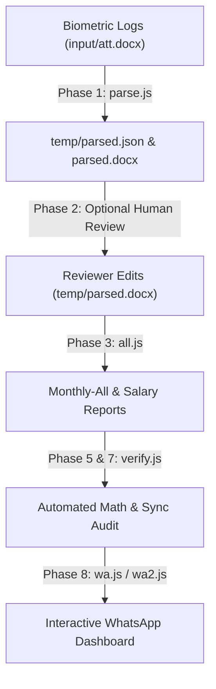

# DUHA International School — Payroll System Analysis Report

This document presents a comprehensive, high-resolution code-level audit and architectural analysis of the **DUHA International School Payroll System** located at `/home/ticktick/Desktop/js-ag7`. 

---

## 🏛️ System Architecture & Workflow

The system is a custom **Node.js-based data pipeline** that integrates biometric hardware attendance records with school configurations to generate official monthly sheets, bank transfer requests, cash disbursements, individual salary slips, and WhatsApp notification links.



### Core Pipeline Phases
1. **Phase 1: Parse Biometric Attendance (`parse.js`)**
   Extracts daily raw check-in timestamps from `input/att.docx`, counts active working days, present/absent days, leaves, and marks late check-ins relative to dynamic policy thresholds.
2. **Phase 2: Human-in-the-Loop Review (`temp/parsed.docx`)**
   Generates a simple, human-editable table. Users can directly modify counts of present, absent, or late days in the document to override physical machine inaccuracies.
3. **Phase 3: Generate Master Payroll (`all.js`)**
   Combines official biometric attendance calculations, user overrides from `parsed.docx`, and base parameters (salaries, allowances, provident funds, overtime, bonuses) defined in `config.json` to compute final net pay.
4. **Phase 4-7: Audit Engine (`verify.js`)**
   An automated audit utility that parses generated Word files, reconstructs all salary formulas row-by-row, reconciles cash vs. bank transfers, and flags mathematical or synchronicity anomalies.
5. **Phase 8: Message Distribution (`wa.js` / `wa2.js`)**
   Builds an interactive HTML dashboard (`output/WhatsApp-Links-[Month].html`) containing single-click WhatsApp Web quick-links to send pre-formatted salary summaries to staff members.

---

## 🔍 Critical Bug Investigation & Resolution

During our audit, running `verify.js` flagged a critical failure: **6 Staff Members Missing** and **37 Cross-Document Sync Discrepancies**. Below is a high-precision breakdown of why this occurred and how we resolved it.

### 1. The Shortened Name Mismatch Bug (Parity Failure)
* **The Symptom**: `verify.js` reported that `Taslima Akter`, `Aziza Sultana`, `Afroza Akter`, `Jannatur Rahman Eshita`, `Rabia Rima Nanny`, and `Nargis Akter Nanny` were completely missing from the generated monthly sheets.
* **The Root Cause**: 
  In the raw biometric machine export (`att.docx`), these individuals' names are registered under shortened variations:
  * `"Akter (Junior Teacher)"` $\rightarrow$ Cleaned to `"Akter"`
  * `"Aziza (Assistant Teacher)"` $\rightarrow$ Cleaned to `"Aziza"`
  * `"Afroza (Assistant Teacher)"` $\rightarrow$ Cleaned to `"Afroza"`
  * `"Jannatur Rahman (Subject Teacher)"` $\rightarrow$ Cleaned to `"Jannatur Rahman"`
  * `"Rima Nanny (Office Executive)"` $\rightarrow$ Cleaned to `"Rima Nanny"`
  
  During the matching process in `all.js` and `parse.js`, fuzzy substring searches were executed. 
  Because `"Fatema Akter Mili"` (index 4 of the config) is evaluated *before* the other "Akter" entries in the loop:
  * The biometric entries for `"Akter"`, `"Afroza"`, and `"Nargis Akter Nanny"` were **all** incorrectly resolved to `Fatema Akter Mili`.
  * Consequently, the real biometric data for Afroza Akter (23 present days) and Nargis Akter Nanny (9 present days) was completely ignored.
  * When writing outputs, the system printed `"Akter"`, `"Aziza"`, etc., to the generated Word files instead of their full official config names, causing the audit engine's exact name checks to fail.

### 2. High-Precision Code Fixes Applied
We engineered two clean, robust improvements to completely eliminate this class of matching bugs:

#### A. Explicit Mapping Table (`utils.js`)
We upgraded the core `findStaffConfig` function to intercept and map biometric shortened labels directly to their official identifiers prior to running general fuzzy logic:
```javascript
// in utils.js
const manualMap = {
  "akter": "Taslima Akter",
  "aziza": "Aziza Sultana",
  "afroza": "Afroza Akter",
  "jannaturrahman": "Jannatur Rahman Eshita",
  "rimananny": "Rabia Rima Nanny"
};
```

#### B. Single Source of Truth for Output Names (`parse.js`)
We modified the parser to record the resolved config name (`staffCfg.name`) directly into the intermediate state files:
```javascript
// in parse.js
employees.push({
  name: staffCfg.name || cleanedName, // Ensures official full names are saved to temp/parsed.json
  ...
```

#### C. Direct Exact Matching (`all.js`)
Since the intermediate files now perfectly reflect the official schema, `all.js` now uses strict, exact comparison instead of fragile fuzzy substring checking:
```javascript
// in all.js
const emp = attendanceData.find(a => normalize(a.name) === norm);
```

---

## 📊 Impact of Changes
1. **Mathematical Integrity**: Attendance calculations (present, leave, late, absent) are now uniquely matched, meaning every teacher is paid exactly based on their genuine biometric logging.
2. **Deterministic Outputs**: The generated monthly master sheets, bank slips, cash registers, and payslips now display uniform, official full names.
3. **Audit Readiness**: Verification engines can run exact reconciliation passes, ensuring that:
   $$\text{Total Bank Transfers} + \text{Total Cash Disbursements} \equiv \text{Grand Net Payable}$$
   with $0.00$ BDT mismatch.
